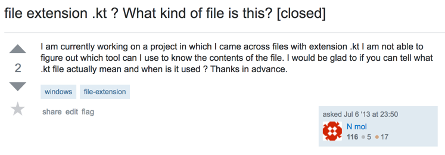
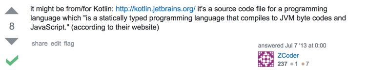

## [你为什么需要 Kotlin](http://blog.csdn.net/tencent_bugly/article/details/54572894)

## 1. 往事

曾经你有段时间研究 Intellij 的插件开发，企图编译 Intellij Idea Community Edition （ICE）的源码，结果发现有个奇怪的东西让你的代码无法编译...什么鬼，kt 是什么玩意儿？






怎么又有新语言出来啊，简直要疯掉了。这时候，你的脑海里面瞬间浮现出了这句话：

> 有困难要上，没困难制造困难也要上。

『靠，这尼玛究竟是谁说的，好有道理！』你调侃道。

为了不丢掉社会主义新青年勤奋刻苦的优良传统，你决定学一下 Kotlin，不过说真的，这决定也是坑苦了自己，毕竟那段时间 Kotlin 的 API 还没有趋于稳定，经常从网上找到个 demo，搞到本地就编不过去，哭死。直到 2016年2月，Kotlin 1.0 正式发布，凌乱的 API 也随着曾经躁动的心的平静而稳定下来，你无需再忍受什么，甚至还有了一种『终于看着娃长大了』的感觉。

## 2. 消失的 Getter 和 Setter

你一直很喜欢 Java，就像你一直喜欢喝黑咖啡一样。原因也很朴实，因为你别的也不怎么会啊。可有一阵子做一个语音聊天的 app，里面各种用户、通话记录等等的数据结构，简直了，写起来长长的一串，光 Getter 和 Setter 就一眼望不到边，每写一个数据结构类，仿佛眼前就是那金黄色的稻田，你吹一口咖啡，它们居然还簌簌作响。最讽刺的是，你发现大家在写有关 Java 的文章的时候，遇到数据结构实体类，经常会这样写：

```kotlin
public class Person{
    private int id;
    private String name;
    //瞅啥瞅，省略掉的是 getter 和 setter！
    ...
}
```

额，这么重复的代码居然占用了 80% 的篇幅，也难怪是个 IDE 就有帮忙生成 Getter 和 Setter 模板的功能。

你说你曾经试图不写 Getter 和 Setter，可作为一个写 Java 这么多年的人，没了 Getter 和 Setter 让你感觉就像是。。。


那时候你看到 C# 里面的属性也真是眼馋呐，『怎么 Java 就不能搞这么个特性呢？』

后来，你发现 Kotlin 居然是有属性的：

```kotlin
data class Person(val id: Int, val name: String)
```

你眼前一亮，放下手中的咖啡，幻想着啥时候去 Kotlin 小岛玩一趟。


## 3. 又见空指针

你的项目都接入了 Bugly，那赶脚就好像在鸡蛋上跳舞哇，每天去打开崩溃统计都心惊肉跳的。这些 crash 里面绝大多数都是空指针异常，这倒不是说空指针本身有什么问题，空指针只能说明程序有考虑不周的情形出现，出现空指针调用通常都是代码的编写问题，那么为什么 Java 会允许潜在的空指针存在呢？你望着窗外，思索着一定是什么蒙蔽了你的双眼，让你看不透，望不穿，寻不见。

```kotlin
person.setName("橘右京");
```

回过神来，突然看到这行代码，你嘟囔着，这哥们名字叫 橘右京，可这哥们是谁？万一他是个 null 呢？


```kotlin
Person person = findPersonFromCacheOrCreate();
person.setName("橘右京");
```

你的目光往上移，看到了上面那行赋值，你开始怀疑，开始问自己：『 
害怕不。。其实我们一直都没有意识到，我们的 Java 代码 处处不让我们放心。』

说来也巧，你最近在梳理项目代码的时候，见到的最多的就是：

```kotlin
if(x != null) x.y();
```

你对你的代码充满了不信任，你的代码会回报你什么呢？

『虚拟机空指针全家桶来一份！。。。那一定很好吃吧』你一脸无奈的自嘲着。


你突然发现这代码居然看上去跟窗外的世界很像，只是，给代码用的净化器应该是什么牌子的呢？

『小米的怕是不行了吧。』你哈哈一笑，似乎对此感到很开心。

那开心转瞬即逝，你不得不面对这令人苦恼的现状。你在 Java 当中除了对自己说『我保证 findPersonFromCacheOrCreate() 不会返回空』，还有什么更让人踏实的办法么？当然没有。

『看看 Kotlin 有没有好办法吧！』于是你尝试着用 Kotlin 写下了类似的代码：

```kotlin
fun findPersonFromCacheOrCreate(): String{
    ...
}
```

当你企图在这个方法中返回 null 时，聪明的 IntelliJ 立即在你的代码上画出红线，告诉你不要这样。

你查了下资料，发现原来在 Kotlin 当中， String 表示一个不可为 null 的字符串类型。这一刻，你的内心感到无比踏实：

```kotlin
val person = findPersonFromCacheOrCreate()
person.name = "橘右京"
```

写 findPersonFromCacheOrCreate 这个方法的人必须给你保证返回的 person 不为 null，他在编写这个方法的时候就要百般小心，不然编译器就要削他了。

『找削袄！』你突然想起微信里面的那套 桃子一家东北话 的表情，想想就好欢乐。


『不过』，你又想，『万一它还是给我返回了 null 怎么办呢？』说着你按照 Kotlin 的要求改了下代码：

```kotlin
fun findPersonFromCacheOrCreate(): String?{
    ...
}
```

结果发现下面的第二行报错。

『什么情况？』你不明白了。

```kotlin
val person = findPersonFromCacheOrCreate()
person.name = "橘右京"
```

> Only safe (?.) or non-null asserted (!!.) calls are allowed on a nullable receiver of type String?

『就是说，如果有人胆敢给我返回个可空类型，我必须做判空处理才可以行呗？』你眼前一亮，旋即惊呼道，『太厉害了！』

紧接着你发现，虽然返回的是可空类型，但这丝毫不会影响你与你的代码谈笑风生，因为 Kotlin 可以给你一千种选择让你的代码看起来犹如行云流水一般，比如你希望拿到 null 直接返回，你就这么写：

```kotlin
val person = findPersonFromCacheOrCreate()?:return
```

或者这里没办法用 return，你一样可以确保 person 不为空的时候执行你的逻辑：

```kotlin
val person = findPersonFromCacheOrCreate()
person?.let{
    //在这里直接用 it 指代 person，绝对不为空
}
person?.setName("安琪拉")//只有person不为空的时候执行
```


## 4. Smart Cast

『听说风已经到张家口了。』亚瑟说。 		
『哦是么，那我们可真得拭目以待呀。』你淡定地说。 		
『待什么，眼前一亮吗，哈哈。』也乐了。 		
『是啊，不过，眼下我倒更希望 Java 能聪明一点儿。。』 		
『它怎么了？』 		
『你看，Java 有一种特别缺心眼的写法：

```kotlin
if(view instanceof ViewGroup){
    ((ViewGroup) view).addView(child);
}
```

强转加方法调用，两对括号，写到手抽筋啊。可我已经告诉 Java view 是 ViewGroup 了啊，结果还是要强转，这种感觉就像我坐地铁的时候本来刷卡进站，结果到了车上，还有人查票！』说完，你忽然觉得口渴，随手拿起热乎的咖啡喝了一口，你眉头一皱，那味道似乎不太好。

『虽然我们写代码应该尽量避免强转，可你明明知道这东西我们无法避免，于是本来想多态的用父类或者接口引用实例，结果强转代码写得多到变态。要是我在判断了 view 的类型之后，在这个类型判断有效的作用域内不用做强转就好了。』你接着说道，一脸的烦恼。

『Kotlin 可以呀，Kotlin 有个特性叫 Smart-Cast，你写的代码就可以像这样：

```kotlin
if(view is ViewGroup){
    view.addView(child) // 现在 Kotlin 已经知道 view 是 ViewGroup 类型了！
}
```

咋样，厉害吧？』亚瑟一脸神气的表情。

『真的呀！』你兴奋的说。

『这你都不知道？』在一旁打游戏的太2真人一如既往地调侃道，他看上去似乎比亚瑟更得意。


## 5. 打日志

『你们连日志都打，真不要脸。。对了，日志是谁，打的时候叫上我啊！』你露出一脸的坏笑。

原来，你有个函数传入了三个参数，

```kotlin
void check(ArrayList<String> list, String tag, int id);
```

你想把他们的值打印一下，于是你不假思索地敲出了一行代码：

```kotlin
System.out.println("list: "+list.size()+"; tag="+tag+";id="+id);
```

这样的语句并没有引起你的任何不适——毕竟，你早已习惯了它的丑陋。你稍稍停顿，活动了一下手指，突然想到那个经久不衰的段子：

> 女神：你能让这个论坛的人都吵起来，我今晚就跟你走。		
> 程序猿：PHP语言是最好的语言！		
> 论坛炸锅了，各种吵架。		
> 女神：服了你了，我们走吧，你想干啥都行。		
> 程序猿：今天不行，我一定要说服他们，PHP语言是最好的语言。

『难怪 PHP 是最好的语言，没有之一呢！』你自嘲着，『至少人家支持字符串模板呀。』

```kotlin
$size = count($list);
echo "list: $size; tag=$tag; id=$id";
```

说来也是好奇，这么好的特性 Kotlin 有没有呢？这家伙最近给你带来的惊喜是在太多了，于是你决定试一试。

```kotlin
println("list: ${list.size}; tag=$tag; id=$id")
```

『嗯————』你满意的点了点头。

## 6. 再见，Utils

你肯定用过 String，不仅如此，你还知道 String 居然连个 empty 方法都没舍得提供，每次都要写 str.equals(“”) ，真是无比丑陋。这还算好的，如果恰好要判断不为空呢？这个应该更常用吧，于是你就会写 !str.equals(“”)，搞不好几个字符敲完了发现，尼玛，还得加个小括号 (!str.equals(“”))...

『怎么可以这么反人类！！！』你嘟囔着，一气之下写了个工具类：

**StringUtils.java**

```kotlin
public class StringUtils{
    public static boolean notEmpty(String str){
        return !"".equals(str);
    }
    public static boolean isEmpty(String str){
        return "".equals(str);
    }
}
```

你满意的点点头，觉得这样就再也不用忍受那些丑陋了。

随后的某一天，阳光依旧试图穿过层层雾霾照到你那北向的屋子的楼的正面，无果，于是垂头丧气的点了一支烟。而你呢，正要写下一句叫做 if(StringUtils.notEmpty(str)){ … } 的代码，你很快地写完 if(str. 疲惫的双眼企盼着 IDE 意会你的小眼神，可它蒙了，String 并不曾有一个叫做 notEmpty 的方法啊。这时候你迟疑了一下，缓过神来，灵活的把右手小拇指从键盘上的 ；移到 backspace，删掉 str. 重新写出 if(StringUtils.notEmpty(str))。多么令人苦恼的经历啊，于是你惆怅的点了一支烟，屋里的空气净化器也开始飞速的转了起来。


『我要是能重写一下 Java 的 String 类好了，我一定先给它加上这俩方法！！』

这时，只见一道亮光闪过，你的窗户上映出了几行字：


你惊喜的差点儿喊出声来。『这真的是 Kotlin 吗？』你有点儿不敢相信自己的眼睛。是的，有了扩展方法，你再也不需要什么 XXXUtils 了。

## 7. 晚安，ButterKnife

『晚安。』你轻轻地对 ButterKnife 说到。你知道这也许是最后一次这样说了，毕竟在 Kotlin 的世界里，ButterKnife 开始变得有些不知所措。

『你不需要我了。』ButterKnife 有些疲惫。		
『不，你是最棒的。』突如其来的这么一句话，让你显得有些慌乱。		
『kotlin-android-extensions 还不够么？』ButterKnife 不耐烦了。		
『可..可是...』你不知道该怎么回答了，毕竟在 Kotlin 出现之后，你很少提及 ButterKnife 了。

是啊，过去你的 View 都是用 ButterKnife 注入的：

```kotlin
@BindView(R.id.nameView) TextView nameView;
...
nameView.setText("橘右京");
...
```

而现在呢？你摇摇头，显得有些无奈。『再也不需要注入 View 了是么？』你在问自己，尽管对过去百般不舍，可你还是很欣赏你的代码现在的样子：

```kotlin
nameView.text = "橘右京"
```

再也不需要 ButterKnife 了，更不需要什么 findViewById 了——这就是命。

## 8. 请和我的代理谈吧

听说有人把 SharedPreference 先生告上法庭了，说他总是在接受新值之后不去做持久化，SP 先生却觉得很委屈：

『先生们，大家都是绅士，我实在想不出什么能比我的信誉更重要。如果你们在给我们更新值的时候调用 commit，我们一定会按照约定完成持久化的。可你们为什么就不愿意 commit 呢？』SP 先生大惑不解。

『请问 SP 先生，我是 《Dalvik 日报》记者，我想问一下，为什么必须要 commit 呢？』		
『您好，这是规定。』SP 先生慢条斯理的回答道。		
『可这有点儿反人类呀！』记者追问道。		
『没关系，基于此次诉讼事件的教训，我们特意引进了高科技人才 Preference< T > 先生，P先生在这方面可是行家了。』

记者打量着这位 P 先生，试图从他身上发现点儿什么。

『哈哈，P 先生是一位 Delegate 吧，SP 先生就是 Delegated Properties 咯~』你从人群中走出来，淡定的说道。

『不错，』P 先生扶了扶眼镜，『这位先生，SP 先生的操作方案是有些繁琐，我们来看个例子：

```kotlin
context.getSharedPreferences("name", Context.MODE_PRIVATE)
    .edit().putString("key", "value").putInt("intKey", intValue).commit();
```

一位绅士需要操作它的时候，总是首先要获取 SharedPreferences 实例，接着 edit 拿到 Editor 实例才能存入值，一方面存入的值存在随意性，key 的值必须约束好才行，否则读取方就无法获取到值，另一方面只有 commit 之后值才可以被存入。这样操作起来确实不是很友好。』

『那 P 先生高见？』你很好奇。

『从今天起，大家如果有需要 SP 先生持久化数据的需求，只需要在我这里登记一次，剩下的，大家只需要像读写变量一样操作即可生效。』P 先生停顿了一下，打量了一下四周，大家都在注视着他，而一旁的 SP 先生也给了他一个坚定的眼神。


『那么以后，如果有位绅士需要我们，比如他需要持久化的数据名叫 “name”，值叫 “橘右京”，当然这个值也是可以修改的，那么他只需要这样操作：

```kotlin
var name by Preference(context, "name", "橘右京", "sp_name")
...
Log.d(TAG, name) // 第一次读取，只能读取到默认值，那就是 橘右京
name = "不知火舞"
Log.d(TAG, name) // 这里输出的就是 不知火舞 啦
```

我们真正做到了读写持久化数据就如同读写内存变量一样简单直接。』

『真的好赞。』你不禁鼓起掌来。『那 P 先生，我能读一下你的源码么？』

……

突然，你的手机振动了一下，打断了你的思绪。你从沉思中回来，发现你眼前不过仍然是你的 IDE，而屏幕上的这段代码，正是 P 先生的源码。真的是太巧妙了：

```kotlin
class Preference<T>(val context: Context, val name: String, val default: T, val prefName: String = "default") : ReadWriteProperty<Any?, T> {
    val prefs by lazy { context.getSharedPreferences(prefName, Context.MODE_PRIVATE) }
    override fun getValue(thisRef: Any?, property: KProperty<*>): T {
        return findPreference(name, default)
    }
    override fun setValue(thisRef: Any?, property: KProperty<*>, value: T) {
        putPreference(name, value)
    }
    private fun <U> findPreference(name: String, default: U): U = with(prefs) {
        val res: Any = when (default) {
            is Long -> getLong(name, default)
            is String -> getString(name, default)
            is Int -> getInt(name, default)
            is Boolean -> getBoolean(name, default)
            is Float -> getFloat(name, default)
            else -> throw IllegalArgumentException("This type can be saved into Preferences")
        }
        res as U
    }
    private fun <U> putPreference(name: String, value: U) = with(prefs.edit()) {
        when (value) {
            is Long -> putLong(name, value)
            is String -> putString(name, value)
            is Int -> putInt(name, value)
            is Boolean -> putBoolean(name, value)
            is Float -> putFloat(name, value)
            else -> throw IllegalArgumentException("This type can be saved into Preferences")
        }.apply()
    }
}
```

『Impressive.』你一副恋恋不舍的样子。『 SP 先生的全名应该不是 SharedPreferences 吧，我觉得他们一定是搞错了，应该是 SophisticatedPreferences 还差不多。P 先生自然就是简化的它咯。』

## 9. 壮士一去兮为啥不复还？

这个问题你想了很久。是荆轲的匕首不够快？还是不够长？

『总之是不好用呗。』你嫌弃地说。

Java 里面也有一副利刃，叫做 Dagger，这把利刃可以帮你生成一些代码。

『如果代码可以聪明到自己写代码，那我们不就要失业了吗？』不知道你说这话是在调侃，还是感到有些恐慌。


Kotlin 之前是无法使用这把利刃的，这可能真的打击了不少人的积极性。不过，这已经不是问题了，因为你在前不久读到 Kotlin 1.0.4 的更新说明的时候，就已经发现 kapt 的存在。只要你添加 apply plugin: “kotlin-kapt” 这句配置，你就可以像在 Java 当中一样使用 Dagger 了——你甚至还做了个 demo 试了一下，程序员嘛，总是无法摆脱成功写出一个 Hello World 程序时获得的内心的愉悦感。

『似乎除了 FindBugs 之类与 Java 语法紧密结合的框架不能直接应用到 Kotlin 上，别的都没有什么问题哎。』你似乎发现了什么。

#### Java 和 Kotlin 的对话 1

> 『Java 叔叔，我。。我怕。。。』Kotlin 怯懦的说。		
> 『有叔叔在呢。』Java 拍着胸脯，安慰道。『世界是你们的，也是我们的，但是归根结底是你们的。你们青年人朝气蓬勃，正在兴旺时期，好像早晨八九点钟的太阳。希望寄托在你们身上。孩子，放手去干吧，搞不定的，找叔叔，叔叔虽然老了，但叔叔还是有自信能帮你搞定。』

你突然回过神来，『我脑洞怎么这么大，哈哈哈~』

#### Java 和 Kotlin 的对话 2

> 『Java 叔叔，我。。我怕。。。』Kotlin 怯懦的说。		
> 『有叔叔在呢。』Java 拍着胸脯，安慰道。『世界是你们的，也是我们的，但是归根结底是你们的。你们青年人朝气蓬勃，正在兴旺时期，好像早晨八九点钟的太阳。希望寄托在你们身上。孩子，放手去干吧，搞不定的，找叔叔，叔叔虽然老了，但叔叔还是有自信能帮你搞定。』		
> 『好的，叔叔，那我就不客气了！』Kotlin 嬉皮笑脸的样子真得很像个小孩子。		
> 『我去，居然装可怜骗你叔叔，看我不打你！』Java 气急败坏道。


『完了，脑洞合不上了。。』你已经陶醉了其实。

在你看来，Kotlin 似乎并不是一门新的编程语言，它看上去更像 Java 的语法糖，只不过，这糖放的彻底了些。

『嗯。。挺甜~』你喝了口咖啡，不过这次不同以往，你放了糖。