# 函数

本章节主要介绍Kotlin中的函数相关的概念。

## 普通函数

### 声明

即使Kotlin是一门面向对象的编程语言，它也是有函数的概念的——而不像Java那样，仅仅有“方法”。

Java中有静态方法来代替函数的作用，但是Kotlin的函数比Java的静态方法自由度大很多。 我们先来看几个例子。

函数声明使用fun保留字，语法比较类似Scala：

```kotlin
fun function() { 
  println("This is a function") 
} 
```

如果你需要一个有参数的函数：

```kotlin
fun functionWithParams(obj: Any?) { 
  println("You have passed an object to this function: $obj") 
} 
```

上面的函数有一个Any?类型的参数。类似的例子还有程序的入口main函数：

```kotlin
fun main(args: Array<String>) { 
} 
```

如果你需要一个返回值的话：

```kotlin
fun functionWithReturnValue(): Int { 
  return Random().nextInt() 
} 
```

如果一个函数不返回东西，你可以不写返回值。也可以让它显示返回Unit：

```kotlin
fun functionReturnsUnit(): Unit { 
} 
```

如果一个函数不会返回（也就是说只要调用这个函数，那么在它返回之前程序肯定GG了（比如一定会抛出异常的函数））， 因此你也不知道返回值该写啥，那么你可以让它返回Nothing：

```kotlin
fun functionReturnsNothing(): Nothing { 
  throw RuntimeException("") 
} 
```

一个函数也可以拥有Java风格的泛型参数：

```kotlin
fun <T> functionWithGenericsParam(t: T): T { 
  return t 
} 
```

Kotlin中的泛型概念和Java基本相同，这里不再展开讨论。关于型变、协变等Java中没有的复杂泛型概念将在下文讨论。

函数参数可以有默认值（关于这个函数中for循环的中缀语法下文会提到，这里可以先忽略）：

```kotlin
fun functionWithDefaultParams(limit: Int = 10): Int { 
  for (i in 0..limit step 2) println(i) 
  return limit 
} 
```

于是你不再需要像Java那样为了默认参数而写一大长串重载函数了。当然，Kotlin也支持重载。

如果一个函数的函数体只需要一个表达式就可以计算出来，比如考虑如下函数：

```kotlin
fun functionReturningIncreasedInteger(num: Int): Int { 
  return num + 1 
} 
```

你可以直接使用这种语法（expression function body）：

```kotlin
fun functionReturningIncreasedInteger(num: Int) = num + 1 
```

第二种语法省略了返回值类型（编译器可以根据后面的表达式推导出返回类型），以及大括号。

同理，比如说我们有一个求平方的函数：

```kotlin
fun square(int: Int) = int * int 
```

如果一个函数是空函数，比如Swing的ActionListener强制要求重载但是又不需要使用的函数，可以通过这种方式来表达：

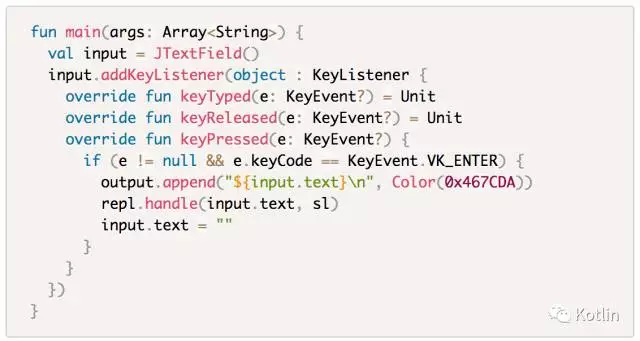

其中， `fun xxx() = Unit` 表示这是一个空函数。

如果一个函数不返回Unit或者Nothing，那么**尽可能让它成为一个纯函数**（即没有副作用的函数）。 这是**函数式编程**的约定。

> 关于函数式编程：
> 函数式编程是一种学院派的编程范式，与之对应的是“命令式编程”。它常常与数学中的范畴论（category theory）结合，追求编写更易维护、并发性更好的程序。业界对它褒贬不一，笔者倾向于将它与面向对象编程结合。

虽然Hadi Hariri曾经在JetBrains中国开发者日上说过Kotlin不是函数式编程语言，但是Kotlin有大量的（看起来非常）函数式的特性、约定、标准库函数。 因此我们可以默认它是追求函数式编程的，那么就应该尽可能遵循函数式法则。

> 为什么返回Unit或者Nothing就不需要纯了呢？

既然一个函数没有返回值，那么对它讨论引用透明也就没有意义了。 如果一个返回Unit或者Nothing的函数没有副作用，那么它的存在也将没有意义。

更多关于函数式编程的知识不在本书讨论范围内，读者可以自行查询相关资料。

## 内部函数

函数里面也可以定义函数：

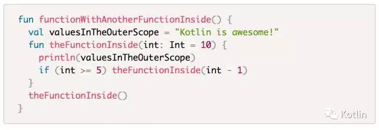

内部函数可以直接访问外部函数的局部变量、常量，Java是做不到这点的哦。

递归也没有任何问题。如上面的代码所示。

## 方法

方法是一种特殊的函数，它必须通过类的实例调用，也就是说每个方法可以在方法内部拿到这个方法的实例。这是方法和函数的不同之处。

方法和函数几乎一模一样，唯一的区别就是方法必须声明在类里面。下面是一个方法和一个函数：

```kotlin
fun thisIsAFunction() = Unit 
　 
class ThisIsAClass { 
  fun thisIsAMethod() = Unit 
} 
```

### 中缀表达式

可能你会好奇上面给出的一个例子中有一个for循环使用的诡异语法，即中缀表达式：

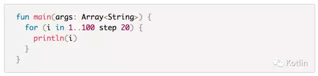

这个step是什么意思呢？

其实是Kotlin方法的一种语法糖，一个方法如果在声明时有一个infix修饰符，那么它可以使用中缀语法调用。

所谓中缀语法就是不需要点和括号的方法调用：

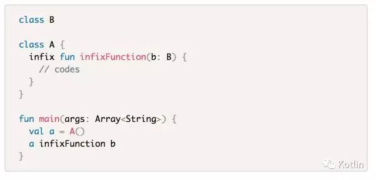

同理，我们只需要给一个类增加一个中缀的step方法就可以实现上面的语法：

```kotlin
class A { 
  infix fun step(step: Int) = Unit 
} 
　 
fun main(args: Array<String>) { 
  val a = A() 
  a step 2 
} 
```

这个功能基本就是用于将代码变得“更易阅读”。 Scala所有函数缺省支持中缀表达式，Kotlin需要单独声明。

### 操作符重载

中缀表达式可以在一定程度上简化函数调用的代码。如果说中缀表达式还不够简洁，那么你一定需要操作符重载了。

Kotlin的操作符重载的规则是：

1. 该方法使用operator修饰符
2. 该方法的方法名必须被声明为特定的名称，以将对应的操作符映射为这个函数的调用
3. 参数必须符合该操作符的规定，比如+的重载就不能有多于一个（不含）的参数，也不能为空参数。

举个例子，我们要重载A类的+运算符。注意三个规定（函数名、参数得符合规矩，加operator修饰）：

```kotlin
class A { 
  operator fun plus(a: A) { 
    println("invoking plus") 
  } 
} 
```

这就是对+的重载了。我们可以这样调用这个函数：

```kotlin
val a = A() + A() 
```

此处的+就是对plus方法的调用了。我们可以运行上面的代码，看到输出："invoking plus"。

当然，操作符重载也可以被替换为函数调用：

```kotlin
val a = A().plus(A()) 
```

这段代码和上面那段完全相同。

还有不少操作符的重载，下面给出一系列例子（仅作为函数名的实例，实现全部为空/false/0（因为部分操作符重载要求返回Int/Boolean））：

```kotlin
class A { 
  operator fun plus(a: A) = Unit 
  operator fun minus(a: A) = Unit 
  operator fun times(a: A) = Unit 
  operator fun div(a: A) = Unit 
  operator fun rem(a: A) = Unit 
  @Suppress("DEPRECATED_BINARY_MOD") 
  @Deprecated("mod should be replaced with rem", ReplaceWith("rem")) 
  operator fun mod(a: A) = Unit 
  operator fun rangeTo(a: A) = Unit 
　 
  operator fun get(index: Int) = Unit 
  operator fun get(index1: Int, index2: Int) = Unit 
  operator fun set(index: Int, value: Any?) = Unit 
  operator fun set(index1: Int, index2: Int, value: Any?) = Unit 
　 
  operator fun invoke(obj: Any?) 
　 
  operator fun inc() = A() 
  operator fun dec() = A() 
  operator fun unaryPlus() = A() 
  operator fun unaryMinus() = A() 
　 
  operator fun compareTo(other: Any?) = 0 
  override operator fun equals(other: Any?) = false 
　 
  operator fun contains(element: Any?) = false 
　 
  operator fun iterator() = object : Iterator<Any> { 
    override operator fun hasNext() = false 
    override operator fun next() = Unit 
  } 
} 
```

首先是最基本的操作符，它们对应的操作符和注释中的一一对应：

```kotlin
class A { 
  operator fun plus(a: A) = Unit // + 
  operator fun minus(a: A) = Unit // - 
  operator fun times(a: A) = Unit // * 
  operator fun div(a: A) = Unit // / 
  operator fun rem(a: A) = Unit // % 
　 
  @Suppress("DEPRECATED_BINARY_MOD") 
  @Deprecated("mod should be replaced with rem", ReplaceWith("rem")) 
  operator fun mod(a: A) = Unit // %，和rem一样 
　 
  operator fun rangeTo(a: A) = Unit // .. 
} 
```

倒数第二个mod是特殊的操作符重载——它在Kotlin1.1中被标记为过时（Deprecated）的。 在1.1中，使用了rem（remainder）来代替mod，符合java.math.BigInteger的命名。

关于最后那个rangeTo有些不符合人的直觉，下面讲到contains的时候会一起提到，读者可以暂时放下这个问题。

然后是下标访问操作符：

```kotlin
class A { 
  operator fun get(index: Int) = Unit 
  operator fun get(index1: Int, index2: Int) = Unit 
  operator fun set(index: Int, value: Any?) = Unit 
  operator fun set(index1: Int, index2: Int, value: Any?) = Unit 
} 
```

get接收任意数量的int参数，假设它们是index1, index2, index3（以此类推）， 那么对应的操作符就是对应维数个下标的访问。比如以下例子，操作符对应的方法调用写在行尾注释里了：

```kotlin
fun main(args: Array<String>) { 
  val a = A() 
  a[1] // a.get(1) 
  a[1][2] // a.get(1, 2) 
} 
```

对应的set接收任意数量个int，以及一个任意类型的对象，表示将下标访问作为左值并赋值：

```kotlin
fun main(args: Array<String>) { 
  val a = A() 
  a[1] = 233 // a.set(1, 233) 
  a[1][2] = "666" // a.set(1, 2, "666") 
} 
```

invoke方法允许你把一个Kotlin对象当作Lambda表达式来使用。关于什么是Lambda表达式下文会专门介绍。

```kotlin
class A { 
  operator fun invoke(obj: Any?) 
} 
　 
fun main(args: Array<String>) { 
  val a = A() 
  a(obj) // 实际上调用了 a.invoke(obj) 
  // 还可以 
  A()(obj) 
} 
```

自增自减运算符就更简单了，它们必须返回自己所在类的子类型。这里直接在注释里面写出对应的操作符表达：

```kotlin
// 假设a是A的一个实例 
class A { 
  operator fun inc() = A() // a++ 
  operator fun dec() = A() // a-- 
  operator fun unaryPlus() = A() // ++a 
  operator fun unaryMinus() = A() // --a 
} 
```

还有比较运算符，这是一个特殊的操作符重载，一个函数将会生成一组操作符。有一个特殊情况，就是相等的判断。

考虑以下代码：

```kotlin
class A { 
  operator fun compareTo(other: Any?) = 0 
  override operator fun equals(other: Any?) = false 
} 
```

当一个类只有compareTo没有equals的时候，所有的六个比较运算符（<, >, <=, >=, ==, !=）会被全部代理给compareTo函数的返回值和0的大小比较：

```kotlin
fun main(args: Array<String>) { 
  A() > A() // A().compareTo(A()) > 0 
  A() < A() // A().compareTo(A()) > 0 
  A() >= A() // A().compareTo(A()) >= 0 
  A() <= A() // A().compareTo(A()) <= 0 
  A() == A() // A().compareTo(A()) == 0 
  A() != A() // A().compareTo(A()) != 0 
} 
```

如果有equals，==和!=两个操作符会被代理给equals方法，其余不变。

```kotlin
fun main(args: Array<String>) { 
  A() == A() // A().equals(A()) 
  A() != A() // !A().equals(A()) 
} 
```

有一个操作符，这个操作符不是严格意义上的“操作符”，但它比起其它的操作符重载，它还多了一个特权。它就是in操作符。

```kotlin
class A { 
  operator fun contains(element: Any?) = false 
} 
```

它要求返回Boolean，传入一个参数。调用的话使用in：

```kotlin
fun main(args: Array<String>) { 
  val ls = listOf(12, 233, 43) 
  println(233 in ls) 
} 
```

这里的in就是调用了ls的contains方法。这里你可能要问了：既然是使用in这个符合Kotlin函数命名规范的表达，为什么不使用中缀表达式呢？

想清楚了，我们暂且不说in其实是Kotlin保留字这个问题，中缀表达式的语法是：

```kotlin
fun main(args: Array<String>) { 
  a.func(b) 
  // 变成 
  a func b 
  // 它不能变成 
  // b func a 
  // 上面那个是错的，会变成b.func(a) 
} 
```

但是a in b其实是调用了b的一个方法，因此中缀表达式无法实现这个in。

前面说到contains操作符有一个特权，我们来看看这个特权。还记得when语句吗？它非常灵活，比Java风格的switch不知道高到哪里去了。这里先看一个基本用法：

```kotlin
fun main(args: Array<String>) { 
  val a = Random(System.currentTimeMillis()).nextInt() 
  when (a) { 
    1 -> { /* codes */ 233 } 
    2 -> 233 
    else -> 666 
  } 
} 
```

它可以配合contains方法：

```kotlin
fun main(args: Array<String>) { 
  val a = Random(System.currentTimeMillis()).nextInt() 
  when (a) { 
    in 1..100 -> 233 
    is Int -> 2333 
    else -> 666 
  } 
} 
```

看到了吗？in还可以这样写哦。

还有一组运算符，它们将被编译为相同的一个操作符，也是in，只不过场合不同。

```kotlin
class A { 
  operator fun iterator() = Unit 
  operator fun hasNext() = false 
  operator fun next() = Unit 
} 
```

这个in是用于for-in循环的。上面例子中的for循环使用的是这个in操作符。

一个标准的Kotlin风格的for循环应该是下面这样的：`kotlin fun main(args: Array<String>) { for (i in 1..10) println(i) } `

它和下面的代码完全等价：

```kotlin
fun main(args: Array<String>) { 
  val range = 1..10 
  val item = range.iterator() 
  while (item.hasNext()) { 
    println(item.next()) 
  } 
} 
```

还记得那个step吗？它其实是对1..100调用了一个中缀的方法step。这下读者对于前面遗留的疑问就全部解决了。

Kotlin关于操作符重载的内容确实比较繁杂，但是比起C++的操作符重载还是要强大那么一点点的（C++没有in这种操作符）。

### Lambda表达式

好了这是函数式编程的重头戏——Lambda表达式。

Lambda表达式俗称匿名函数，熟悉Java的大家应该也明白这是个什么概念。Kotlin的Lambda表达式更“纯粹”一点， 因为它是真正把Lambda抽象为了一种类型，而Java只是单方法匿名接口实现的语法糖罢了。

Lambda在Java中非常常用，这里不再单独介绍它。

Lambda表达式最常用的地方之一是为GUI控件设置监听器：

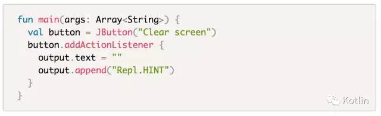

还有调用集合框架抽象出来的高阶函数（Higher Order Function）：

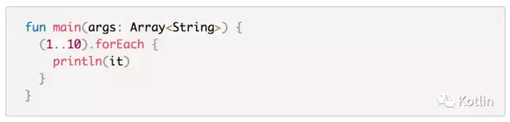

上面的代码可能会令读者产生疑惑，那个it是什么鬼？

it是Kotlin为单参数的Lambda钦定的默认参数名。单参数的Lambda可以省去参数的声明，转而使用it这个名字。

首先，我们有无参数的Lambda表达式：

```kotlin
fun main(args: Array<String>) { 
  { } 
} 
```

你可以直接把它写在外面，并且把它当成对象使用。Lambda对象有缺省的invoke函数的实现，也就是调用这个Lambda：

```kotlin
fun main(args: Array<String>) { 
  { println("invoking lambda") }.invoke() 
} 
```

你也可以使用操作符重载的方式调用invoke函数：

```kotlin
fun main(args: Array<String>) { 
  { println("invoking lambda") }() 
} 
```

如果一个Lambda有参数，那么需要使用这样的语法声明：

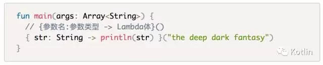

如果有多个参数：

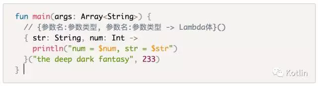

Lambda变量的签名不需要写参数名，只需要写类型。Lambda的返回值就是最后一个表达式的返回值。就像这样：

```kotlin
fun main(args: Array<String>) { 
  // 只需要写类型，我没骗你吧 
  val value: (String, Int) -> Int 
  value = { str: String, num: Int -> 
    println("num = $num, str = $str") 
    num 
  } 
  value("the deep dark fantasy", 233) + 1 
} 
```

如果Lambda的参数、返回值类型不匹配，互相赋值是会报错的哦。

当然，Lambda经常作为函数参数使用。

- 如果一个Lambda是一个函数的最后一个参数，Kotlin为这种情况专门提供了一个语法糖。
- Lambda在作为匿名变量传递给函数时，不需要显式声明参数类型（因为可以根据函数参数那里的类型签名推导）。

上面两句话如何理解呢？比如你有一个自定义UI控件：

```kotlin
class KotlinButton : View() { 
  fun setOnClickListener(block: (View) -> Unit) { 
    // set 
  } 
} 
```

然后调用的时候就可以使用这个语法糖了：

```kotlin
class MainActivity : AppCompatActivity() { 
  override fun onCreate(save: Bundle?) { 
    val a = KotlinButton() 
    // 原本是： 
    // a.setOnClickListener({ view -> 
    //   toast("Clicked") 
    // }) 
    // 语法糖省去了表示参数的括号，直接写Lambda 
    a.setOnClickListener { view -> 
    // 编译器的类型推导省去了 view: View 的类型声明 
      toast("Clicked") 
      view.text = "Oh my god" 
    } 
  } 
} 
```

上面那段代码是Android的，熟悉的API看出来了吗？

你甚至还可以把那个view参数的声明给省了，因为只有一个参数，可以使用it代替：

```kotlin
fun main(args: Array<String>) { 
  a.setOnClickListener { 
    toast("Hia hia") 
    it.text = "clicked" 
  } 
} 
```

如果一个函数不只是有一个参数，但是最后一个参数（依然符合条件），那么可以这样写：

```kotlin
fun main(args: Array<String>) { 
  a.callSomeMethods(1, 2, 3) { 
    // do something 
  } 
} 
```

它完全等价于：

```kotlin
fun main(args: Array<String>) { 
    a.callSomeMethods(1, 2, 3, { 
      // do something else 
    }) 
} 
```

如果你不需要用到那个参数，又不想为它命名，那么使用下划线代替它吧。

```kotlin
fun main(args: Array<String>) { 
  a.setOnClickListener { _ -> 
    toast("LOL LOL LOL") 
  } 
} 
```

此时你可能会问：上面那个代码完全可以把整个`_ ->`给省掉啊？不是说单参数可以省吗？

因为多参数是不能省的（多参数Lambda不写参数会报错），所以它还是很有用的：

```kotlin
fun main(args: Array<String>) { 
  listOf(1, 2, 3).forEachIndexed { _, _ -> 
    println("Looping!") 
  } 
} 
```

最后说的这个下划线的特性是Kotlin1.1才引入的。

**请读者注意不要混淆上面的两个“多参数”，第一处说的是函数多参数，第二处说的是Lambda多参数。**

我们可以通过Lambda表达式来勉强地实现函数的柯里化：

```kotlin
fun plus(a: Int) = { b: Int -> a + b } 
```

调用就可以这样：

```kotlin
fun main(args: Array<String>) { 
  println(plus(233)(666)) 
} 
```

这有什么用呢？可以实现一个函数的部分应用。

```kotlin
fun main(args: Array<String>) { 
  val a = plus(233) 
  // 然后呱啦呱啦呱啦一堆东西 
  val pluser2 = getIntFromSomewhere() 
  println(a(pluser2)) 
} 
```

和泛型结合之后可以泛化出上面那个函数的抽象：

```kotlin
fun <A, B, C> ((a: A, b: B) -> C).curry() = 
    { a: A -> { b: B -> invoke(a, b) } } 
```

plus就可以这样被抽象出来：

```kotlin
fun main(args: Array<String>) { 
  val plusOrigin = { a: Int, b: Int -> 
    a + b 
  } 
  val a = plusOrigin.curry() 
  a(233)(666) // 和上面那个就是一样的了 
} 
```

我们还可以做出多参数的柯里化的抽象：

```kotlin
fun <A, B, C, D, E, F, G> 
 ((a: A, b: B, c: C, d: D, e: E, f: F) -> G).curry() = 
     { a: A -> { b: B -> { c: C -> { d: D -> { e: E -> 
     { f: F -> invoke(a, b, c, d, e, f) } } } } } } 
```

这样的抽象可以用于更多参数的函数的柯里化：

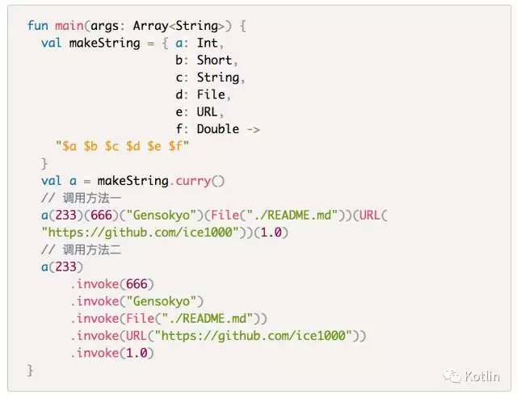

就是这样。

### 调用

函数调用写法和Java几乎完全一样，比如调用上面声明的几个函数：

```kotlin
fun main(args: Array<String>) { 
  functionWithGenericsParam(233) 
  functionReturnsNothing() 
} 
```

已经说过了Lambda的invoke写法所以这里不再提及。

当你需要调用一个接收了“有返回值的Lambda”的函数时，这样的写法是会报错的：

```kotlin
fun main(args: Array<String>) { 
  function { 
    println("Hi there!") 
    // 下面这句会报错！ 
    // return 233 
  } 
} 
```

因为这样的return语句在被inline之后，编译器不知道你是要return掉main函数还是这个Lambda。

因此你需要显式声明return的作用域：

```kotlin
fun main(args: Array<String>) { 
  function { 
    println("Hi there!") 
    return@function 233 
  } 
} 
```

这叫做“Label return”，其中`return@`后面的标签（Label）是你要return的Lambda所传递给的函数名（比如上面就是function）。

如果你的函数名是kotlinIsAwesome，那么你就需要这样写：

```kotlin
fun main(args: Array<String>) { 
  kotlinIsAwesome { 
    return@kotlinIsAwesome 233 
  } 
} 
```

如果你使用IntelliJ IDEA，它会告诉你你需要写什么标签。

## 内联函数

顾名思义，就是把函数体给内联到调用处。这对程序的逻辑是没有影响的，只是对一些无关逻辑的因素有影响，比如：

- 运行效率
- 目标文件体积
- 重构上的优越性

等等。

比如标准库的一堆函数：

```kotlin
/** Prints the given message to the standard output stream. */ 
@kotlin.internal.InlineOnly 
public inline fun print(message: Any?) { 
    System.out.print(message) 
} 
```

内联函数最好的好处就是直接内联Lambda，不产生匿名内部类对象。这是一个非常黑的黑科技， 减少Lambda对象的数量可以既保证函数式的优美代码，又不必为Lambda对象的开销买单。

如果一个内联函数没有内联到Lambda表达式，那么Kotlin编译器会给出一个警告—— 因为inline本身就只是为了inline掉Lambda而准备的特性，标准库会有一些专门用于内联的函数（后面会讲到）。 inline一些无关紧要的函数反而会导致无谓的体积增加（JVM本身就会在运行时内联不少函数）。

Kotlin-discussion曾经出现过一个帖子，楼主说他太喜欢inline这个功能了， 以至于把大量的大型函数inline的到处都是，最后导致了jar体积的肥大。

### crossinline与noinline

crossinline是一种比普通inline更高级的inline方法，它只能修饰Lambda参数， 用于处理一些奇怪的Lambda的内部return（有时你只是想return掉Lambda，但是内联后会导致return掉外部context）。

Kotlin编译器使用了一些奇怪的方法来复用内联Lambda产生的参数。

```kotlin
fun crossInlineFunction(crossinline f: () -> Unit) { 
  f.invoke() 
} 
```

noinline也只能用于修饰Lambda参数，表示在内联这个函数的情况下，不对这个Lambda进行内联优化 （即：依然针对Lambda产生一个匿名内部类对象，开销和Java的就一样了。 有些情况编译器无法内联这个Lambda，只能提示你加上noinline。这里不再展开讲解）。

```kotlin
fun noInlineFunction(noinline f: () -> Unit) { 
  f.invoke() 
} 
```

因此，请读者尽可能遵循标准规定：仅对接收Lambda的函数使用内联。

## 扩展函数

扩展可谓是Kotlin的“killer feature”，它只是一个语法糖，却是一个（有时）难以理解的语法糖，一般黑带Kotlin程序员会谨慎并大量地使用它。

在IDE的帮助下，扩展对原库的污染已经不再是污染，因为扩展和原方法会被高亮给清晰地区分开。

下文中，有时会把扩展函数称为扩展方法，指的实际上是同一个概念。

### 普通的扩展函数

说了这么多，扩展到底是什么呢？

> 就是使用一些语法糖来假装给一些类添加方法，并像真正的方法一样调用它。

为什么要“假装给类添加方法”呢？

> 你有种给java.io.File类添加一个openOrCreate方法啊？

（以上调侃并不适用于rt.jar开发人员）

你可能还是不能理解这是什么，那么看看下面的例子吧：

```kotlin
fun main(args: Array<String>) { 
  val ls = java.util.ArrayList<Int>() 
  ls.add(233) 
  ls.add(666) 
  ls.add(555) 
  ls.add(1024) 
  val sum = ls.fold(0) { sum, value -> 
    sum + value 
  } 
  println(sum) 
} 
```

以上代码使用Kotlin1.1第一个正式版编译器编译通过。在JRE1.8_101上完美运行。

你肯定知道，java.util.ArrayList是没有fold这个方法的。

那上面的代码是怎么回事？为什么我可以在ls对象上调用一个它本来没有的方法呢？

这完全符合刚才的定义：

> 像真正的方法一样调用它。

那么我们来看看这个方法怎么实现吧。这里不使用集合框架，而是使用另一个例子：给File类增加一个openOrCreate方法。

首先，我们可以这样：

```kotlin
fun openOrCreate(file: java.io.File) { 
  if (!file.exists()) file.createNewFile() 
} 
```

然后这样调用它：

```kotlin
fun main(args: Array<String>) { 
  openOrCreate(File("./save.txt")) 
} 
```

但是如果我们希望一种更优美的方式，我们可以使用这个语法：

```kotlin
fun File.openOrCreate() { 
  if (!exists()) createNewFile() 
} 
```

卧槽！那个`if (!exists())`看起来就像是直接写在File类内部的方法一样啊！

其实这里是个小小的trick，编译器会这样处理它：

```kotlin
fun openOrCreate(receiver: File) { 
  if (!receiver.exists()) receiver.createNewFile() 
} 
```

也就是说，如果将`fun openOrCreate(receiver: File)`写成`fun File.openOrCreate()`， 那么这个函数可以直接调用File类的方法，就像它自己也是一个File类的方法一样。编译过后它会被处理为对receiver的方法调用。

也就是说，这种扩展方法是不能调用private、protected以及internal的属性/方法的（因为它事实上就是一个普普通通的函数罢了）。

我们来看看它的调用吧：

```kotlin
fun main(args: Array<String>) { 
  val file = File("./save.png") 
  file.openOrCreate() 
} 
```

是不是很有趣啊？

而且，在意识到了这只是一个普通方法后，你可能会问：能不能将它当成普通函数而不是方法运行呢？

当然...不可以：

```kotlin
fun main(args: Array<String>) { 
  val file = File("./save.png") 
  openOrCreate(file) // error 
} 
```

当然，你也可以在一个类里面对另一个类进行扩展：

```kotlin
class A(val int: Int) 
class B { 
  fun A.someFunction() { 
    println(int) 
  } 
　 
  fun anotherFunction() { 
    val a = A() 
    a.someFunction() 
  } 
} 
```

这也是合法的。

在一个扩展函数内部，this所指向的就是receiver。

```kotlin
fun File.openOrCreate() { 
  if (!this.exists()) this.createNewFile() 
} 
```

读者可以通过在扩展函数内部调用`println(this)`来验证。

### 扩展Lambda

其实扩展还有一种用途，就是使一个Lambda成为“扩展Lambda”：

```kotlin
fun main(args: Array<String>) { 
  val extensionLambda = Int.{ println(this) } 
  233.extensionLambda() // OK 
  extensionLambda(233) // OK 
} 
```

看到了吗？Lambda表达式也可以被理解为是“对一个类进行扩展的Lambda”表达式。 也就是说，它也可以像扩展方法一样，从内部拿到一个特定的this，然后将它作为一个扩展使用。

扩展Lambda也可以作为一个函数的参数。

不同于扩展函数，扩展Lambda可以被当作一个非扩展Lambda。

```kotlin
fun applyToFile(block: File.() -> Unit) { 
  val file = File() 
  file.block() // OK 
  block(file) // OK 
} 
```

这么写，没人拦着你，我不会拦着你，编译器也不会拦着你。这个代码和上面的代码都是合法的Kotlin代码。

注意，以上代码仅为演示语法，是没有实际意义的。

我们还可以结合扩展函数和扩展Lambda：将一个扩展Lambda作为一个扩展函数的参数。

```kotlin
fun File.run(block: File.() -> Unit) { 
  this.block() // OK 
  block(this) // OK 
} 
```

this一般可以省略，所以有：

```kotlin
fun File.run(block: File.() -> Unit) { 
  block() 
} 
```

还可以结合Kotlin的“expression body”：

```kotlin
fun File.run(block: File.() -> Unit) = block() 
```

在调用的时候，可以再结合一下Kotlin的Lambda参数语法糖：

```kotlin
fun main(args: Array<String>) { 
  val file = File("./save.log") 
  file.run { 
    if (!exists()) createNewFile() 
  } 
} 
```

这相当于是给File类提供了一个run的工具函数，它可以把一个Lambda应用到file对象。

请读者确保自己能读懂以上代码，它用到了很多Kotlin的（比较）高级的特性：

- 扩展函数
- 扩展Lambda
- Lambda作为最后一个参数的简化写法

到这里就结束了吗？

不，你可能已经想到了另一个JVM支持的特性，它和扩展结合起来能做到更优美。

还记得吗？这是JVM很早就引入的一个特性。

**泛型**。

### 泛型扩展

首先考虑如下代码：

```kotlin
fun <T> runWith(receiver: T, block: T.() -> Unit) { 
  receiver.block() 
} 
```

这个函数用泛型抽象了一个“runWith”的概念，也就是说传入一个对象和一个扩展给该对象的类型的Lambda，然后在这个对象上调用这个Lambda：

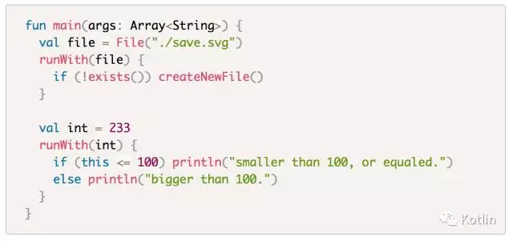

我们再结合扩展：

```kotlin
fun <T> T.run(block: T.() -> Unit) { 
  block() // OK 
  this.block() // OK 
  block(this) // OK 
  block.invoke(this) // OK 
} 
```

上面展示了四种截然不同但是完全等价的调用block的方法，读者在抄代码的时候请只保留一个。

这个run变得更玄学了，可以直接在任意类型的任意对象上调用run方法了：

```kotlin
fun main(args: Array<String>) { 
  Random().nextInt(200).run { 
    if (this <= 100) println("smaller than 100, or equaled.") 
    else println("bigger than 100.") 
  } 
} 
```

还记得吗？接收Lambda对象的函数是被建议写为inline的：

```kotlin
inline fun <T> T.run(block: T.() -> Unit) { 
  block() 
} 
```

这样省去了Lambda传递的开销，和朴素写法就**完全**等价了。

所以亲爱的读者，还记得之前提到的集合框架多出来的fold方法吗？这是内置在Kotlin标准库的扩展函数。

Kotlin的标准库，基本由扩展函数组成。它通过扩展，结合Java标准库本身已经有的一个非常强大的集合框架， 通过打包后仅仅700kb的jar作为标准库，却非比寻常的强大。

我们来看看其它JVM语言的做法：

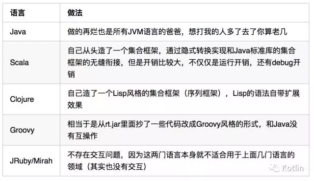

相比之下，Kotlin这种做法是非常友善的（inline零开销，完美利用rt.jar，而且可以随心所欲地扩展）。

### 关于扩展是否会污染原库的讨论

曾经Kotlin社区有人询问过关于扩展函数是否会污染原库的问题。

JetBrains显然考虑到了这点，他们通过IDE插件将两种方法高亮成了不同颜色，完美区分了普通方法和扩展方法：

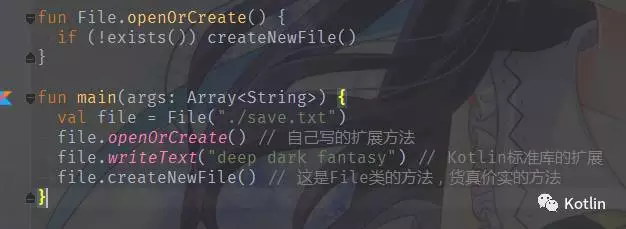

如果你是IntelliJ IDEA用户，那么应该早就注意到这一点了。

缺省设置是黄色，可以在这里调整：

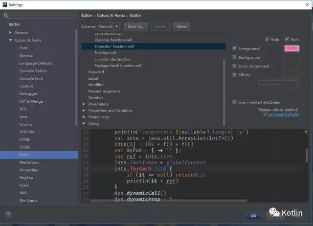