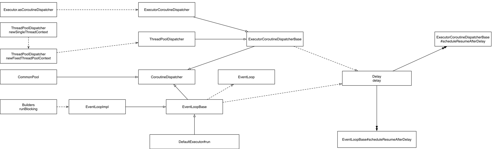
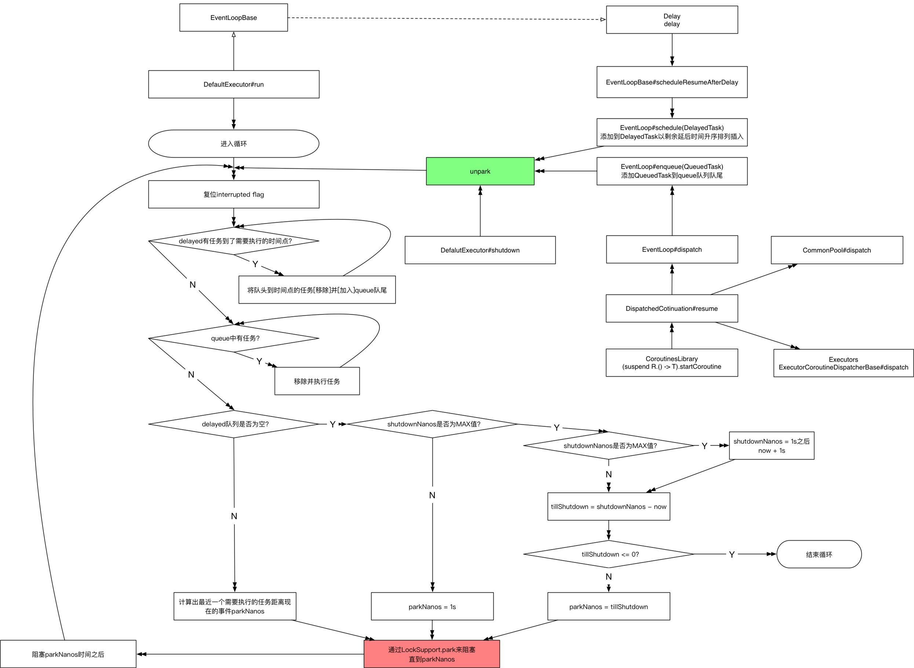

## 协程

* [轻量级线程：协程1](轻量级线程：协程1.md)
* [轻量级线程：协程2](轻量级线程：协程2.md)
* [深入理解 Kotlin Coroutine_1](深入理解 Kotlin Coroutine_1.md)
* [深入理解 Kotlin Coroutine_2](深入理解 Kotlin Coroutine_2.md)
* [深入理解 Kotlin Coroutine_2](深入理解 Kotlin Coroutine_3.md)

协程提供了一种避免阻塞线程并用更廉价、更可控的操作替代线程阻塞的方法：协程挂起。

Coroutine是编译器级的，Process和Thread是操作系统级的。

@RestrictsSuspension 注解

kotlinx.coroutines 框架

### kotlin协程挂起



### kotlin挂起分析



----

| 方法声明                | 功能描述                                     |
| ------------------- | ---------------------------------------- |
| Job launch()        | 启动协程。创建运行在CoroutineContext中的coroutine，返回的Job支持取消、启动等操作，不会挂起父coroutine上下文；可以在非coroutine中调用 |
| Deferred async()    | 启动一个协程, 与其他协程并发地执行，异步，带返回值。创建运行在CoroutineContext中的coroutine，并且带回返回值(返回的是Deferred，我们可以通过await等方式获得返回值) |
| runBlocking()       | 启动一个协程，由它创建的协程会直接运行在当前线程上。创建一个coroutine并且阻塞当前线程直到代码块执行完毕，这个一般是用于桥接一般的阻塞式编程方式到coroutine编程方式的，不应该在已经是coroutine的地方使用。 |
| run()               | 创建一个运行在 CoroutineContext 指定线程中的代码块，效果是运行在 CoroutineContext 线程中并且挂起父coroutine上下文直到代码块执行完毕 |
| delay()             | 非阻塞的sleep()，只是挂起协程本身                     |
| repeat()            | 执行重复任务                                   |
| withTimeout()       | 设置协程超时时间                                 |
| yield()             | 一个suspend方法, 放弃执行权, 并将数据返回               |
| measureTimeMillis() | 计算执行时间                                   |
| produce()           |                                          |

```kotlin
public suspend fun <T> run(
    context: CoroutineContext,
    start: CoroutineStart = CoroutineStart.DEFAULT,
    block: suspend () -> T
): T = suspendCoroutineOrReturn sc@ { cont ->
	...
}
```

- newSingleThreadContext()
- newFixedThreadPoolContext()

### 挂起函数

挂起 suspend，非阻塞

挂起函数suspend，挂起函数不能在普通函数中调用，必须在协程上下文中调用

### CoroutineStart

协程启动选项

- DEFAULT
- LAZY

### CoroutineContext

协程上下文，就是代码块执行在哪个场景。

- CoroutineContext.Key
- AbstractCoroutineContextElement
- EmptyCoroutineContext

### CoroutineScope

- isActive
- context

### CoroutineDispatcher

调度器

- CommonPool 共享线程池（一个有线程池的上下文）
- HandlerContext
- Unconfined
- dispatch(context: CoroutineContext, block: Runnable)

### Job

后台任务，持有该协程的引用。非阻塞。

Job launch()

```kotlin
public fun launch(
    context: CoroutineContext,
    start: CoroutineStart = CoroutineStart.DEFAULT,
    block: suspend CoroutineScope.() -> Unit
): Job {
    val newContext = newCoroutineContext(context)
    val coroutine = if (start.isLazy)
        LazyStandaloneCoroutine(newContext, block) else
        StandaloneCoroutine(newContext, active = true)
    coroutine.initParentJob(context[Job])
    start(block, coroutine, coroutine)
    return coroutine
}
```

Deferred async()

| 方法声明        | 功能描述                |
| ----------- | ------------------- |
| isActive    |                     |
| isCompleted |                     |
| cancel()    | 取消协程任务              |
| join()      | 让主线程一直等到当前协程执行完毕再结束 |

Deferred(Job的子接口)，携带返回值

- DeferredCoroutine
- LazyDeferredCoroutine

| 方法声明    | 功能描述 |
| ------- | ---- |
| await() | 获取结果 |

### Continuation

挂起的协程可以作为保持其挂起状态与局部变量的对象来存储和传递。这种对象的类型是 Continuation

| 方法声明                  | 功能描述                               |
| --------------------- | ---------------------------------- |
| context               | CoroutineContext上下文                |
| resume()              | 传给resume的参数会变成suspendCoroutine的返回值 |
| resumeWithException() |                                    |

### ContinuationInterceptor

拦截器，可以把协程的操作拦截

- interceptContinuation()

### 协程的基本操作

包级函数

| 方法声明                         | 功能描述 |
| ---------------------------- | ---- |
| createCoroutine()            | 创建协程 |
| startCoroutine(Continuation) | 开始协程 |
| suspendCoroutine()           | 挂起协程 |

```kotlin
public inline suspend fun <T> suspendCoroutine(crossinline block: (Continuation<T>) -> Unit): T =
        suspendCoroutineOrReturn { c: Continuation<T> ->
            val safe = SafeContinuation(c)
            block(safe)
            safe.getResult()
        }
```
suspendCoroutine的作用就是将当前执行流挂起, 在适合的时机再将协程恢复执行, 我们可以看到他的参数是一个lambda, lambda的参数是一个Continuation，Continuation了, 它表示一段执行流。Continuation实例代表的执行流是从当前的suspension point开始, 到下一个suspension point结束, 当前的suspension point就是调用suspendCoroutine这一刻.

```
suspendCoroutine { cont ->
    // 如果本lambda在返回前, cont的resume和resumeWithException都没有调用
    // 那么当前执行流就会挂起, 并且挂起的时机是在suspendCoroutine之前
    // 就是在suspendCoroutine内部return之前就挂起了

    // 如果本lambda在返回前, 调用了cont的resume或resumeWithException
    // 那么当前执行流不会挂起, suspendCoroutine直接返回了, 
    // 若调用的是resume, suspendCoroutine就会像普通方法一样返回一个值
    // 若调用的是resumeWithException, suspendCoroutine会抛出一个异常
    // 外面可以通过try-catch来捕获这个异常
}
```

在Kotlin内部, 协程被实现成了一个状态机, 状态的个数就是suspension point的个数+1(初始状态), 当前的状态就是当前的suspension point, 当调用resume时, 就会执行下一个Continuation.

### Channel

- SendChannel
- ReceiveChannel
- Channel

| 方法声明               | 功能描述 |
| ------------------ | ---- |
| isClosedForSend    |      |
| isClosedForReceive |      |
| send()             |      |
| receive()          |      |
| close()            | 关闭通道 |

### 生成器

| 方法声明                     | 功能描述 |
| ------------------------ | ---- |
| Sequence buildSequence() |      |
| buildIterator()          |      |
| yield()                  |      |
| yieldAll()               |      |

### 状态机

对具有逻辑顺序或时序规律事件的一种描述方法。

- 有限状态机
- 两种状态机：Moore型和Mealy型

状态机的主要用途

## 协程与协程的区别

- 线程是抢占式的，协程是非抢占式的
- 线程是操作系统层面的，协程是编译器级的，应用层面，由虚拟机调度
- 线程是在kernel空间，协程是在用户空间
- 线程异步代码有大量的callback，阅读性差；协程代码阅读性更好，更优雅，以同步的代码实现异步功能